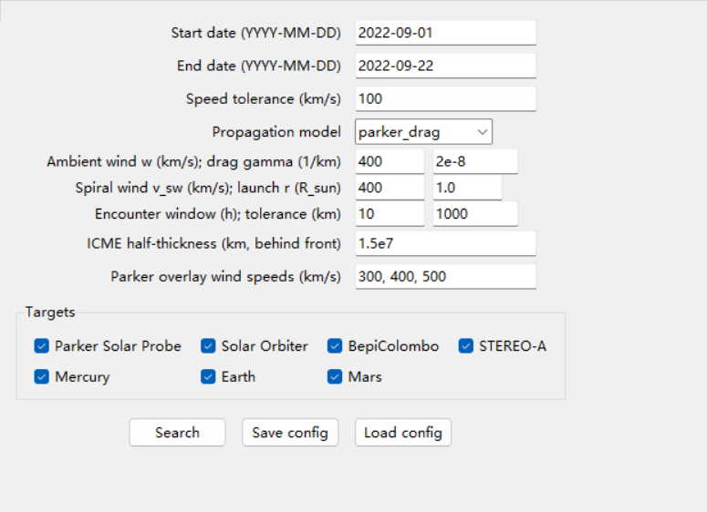
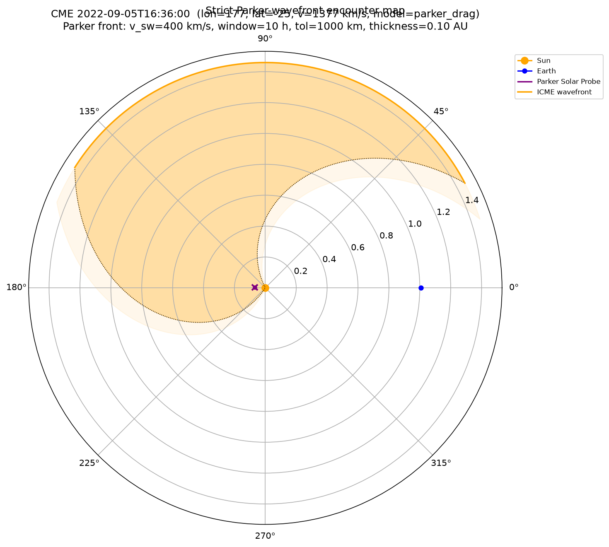

# CME-MOSS

**Coronal Mass Ejection — Multiple Objects Search Software**

Research-grade, multi-spacecraft CME/ICME analysis software. CME-MOSS queries the CCMC **DONKI** CME catalog, propagates ICME wavefronts through the inner heliosphere along Parker-spiral background-flow geometry with
drag-based velocity evolution, determines — with a strict dynamic
time-space test — which spacecraft or planets are *actually swept by the
wavefront*, overlays the background-solar-wind Parker spiral, downloads and
plots in-situ solar-wind data, and presents everything in a desktop GUI or from
the command line.

Targets: Parker Solar Probe, Solar Orbiter, BepiColombo, STEREO-A, Mercury,
Earth (L1: WIND/ACE), Mars.

## Software Overview

Heliophysics and space-weather research repeatedly asks one question: *when
does an interplanetary coronal mass ejection (ICME) actually encounter a given
spacecraft or planet?* Answering it requires combining a CME catalog, spacecraft
ephemerides, an ICME propagation model, and a defensible encounter criterion —
usually by stitching together scripts and ad-hoc geometry.

CME-MOSS provides this as one reproducible, parameter-driven pipeline:

- a single serialisable `SearchParameters` object defines a complete analysis
  (date window, propagation model, velocity-evolution and encounter parameters,
  targets);
- four propagation models, from a pure geometric cone to a Parker-spiral axis
  with drag-based deceleration/acceleration, can be compared on the same event;
- an **encounter is only reported when the dynamically propagating wavefront
  sweeps across the probe and the probe then stays inside the ICME region** —
  a static cone intersection, mere proximity, or entering the region without a
  wavefront sweep are all rejected;
- the same analysis runs identically from the GUI, the CLI, or the Python API,
  and every run is fully reproducible from its JSON configuration.

## Main Capabilities

- **CME / ICME event analysis** — CME candidates from the DONKI CMEAnalysis
  catalog (event time, source longitude/latitude, cone half-width, speed).
- **ICME propagation** — four selectable models (Parker-spiral axis + drag
  evolution, Parker-spiral axis + constant speed, straight axis + drag
  evolution, straight axis + constant speed).
- **Velocity evolution / deceleration** — two-branch drag-based model
  (Vršnak et al. 2013): fast ICMEs decelerate toward the ambient solar wind,
  slow ICMEs accelerate; relaxation is controlled by an ambient-wind speed `w`
  and a drag parameter `γ`.
- **Parker-spiral solar-wind geometry** — background-flow spiral
  (`Parker 1958`), spiral angle, ballistic footpoint mapping, and background
  spiral guide lines overlaid on demand.
- **ICME wavefront & encounter detection** — the wavefront front radius, front
  speed, bent axis and finite ICME region (angular cap + radial half-thickness)
  are evaluated at every ephemeris sample; a sweep crossing (radial gap crossing
  zero within a tolerance, inside a user-set time window) followed by ICME-region
  membership is required for a confirmed encounter.
- **Spacecraft orbit analysis** — multi-body heliocentric trajectories from
  NASA/JPL Horizons, sampled to the propagation window, with polar orbit tracks
  and encounter segments.
- **Scientific visualization** — polar orbit/cone/wavefront maps (curved
  leading wavefront, filled ICME body) and multi-panel in-situ time series
  (magnetic field / velocity / density / temperature).
- **GUI-based analysis workflow** — a research-workflow notebook
  (Data/Event → Propagation → ICME/Encounter → Orbit/Cone Map →
  Visualization/Export) with per-parameter units, tooltips and model
  descriptions.
- **Reproducible export** — legacy-compatible TSV report, full JSON result
  (parameters + events + encounters), and publication-quality figures
  (PNG/PDF/SVG).

## Scientific Workflow

```
Input data (DONKI catalog + Horizons ephemeris)
        |
        v
Event / CME parameters (SearchParameters)
        |
        v
Solar-wind / Parker background-flow model
        |
        v
ICME propagation (front radius, front speed, bent axis)
        |
        v
ICME wavefront (finite spatial extent: angular cap + radial half-thickness)
        |
        v
Spacecraft trajectory (ephemeris samples in the propagation window)
        |
        v
Spatiotemporal encounter detection (coarse time -> coarse angular/radial
screen -> Parker propagation -> sweep refinement -> region membership)
        |
        v
Scientific visualization / export (wavefront map, in-situ panels, JSON/TSV)
```

## Physical Models

All four propagation models share the same building blocks
(`cmemoss/physics/wavefront.py`):

| Model | Radial speed law | Axis geometry | Physical status |
|---|---|---|---|
| `parker_drag` *(default)* | Two-branch drag-based model (DBM): `v(t) = w + (v0-w)/(1+γ|v0-w|t)` | Parker-spiral bend `lon(r) = lon0 - Ω(r-r0)/v_sw` | Physics: drag evolution + background-flow geometry |
| `parker_ballistic` | Constant `v0` | Parker-spiral bend | Background-flow geometry, no velocity evolution |
| `drag` | Two-branch DBM | Straight (fixed longitude) | Physics: drag evolution, no bending |
| `ballistic` | Constant `v0` | Straight | Geometric approximation (legacy) |

- **ICME spatial extent / wavefront** — the ICME occupies an angular cap of
  the catalog cone half-width (plus a 10° tolerance) around the bent axis and a
  radial shell of thickness `H` behind the front (`icme_half_thickness_km`,
  default 0.10 AU). The leading wavefront is drawn as a curved arc derived from
  the propagation parameters.
- **Encounter criteria** — a confirmed encounter requires (i) the front radius
  to sweep across the probe radius inside the encounter window (default 10 h),
  i.e. the radial gap `r_front - r_probe` crosses `±tolerance` (default
  1000 km) between samples; and (ii) the probe to remain inside the ICME region
  afterwards (`0 ≤ gap ≤ H` within the angular cap).

## Installation

Python 3.11+ recommended. Core runtime dependencies (declared in
`pyproject.toml`): `numpy>=1.26`, `astropy>=6.0`, `sunpy>=6.0`,
`matplotlib>=3.8`, `requests>=2.31`. The in-situ download stack (`pyspedas`) is
an optional extra; orbit geometry, cone search and plotting work without it.

```bash
# core (catalog, ephemeris, physics, plots, GUI)
pip install -e .

# add the heavy in-situ download stack (pyspedas / CDAWeb)
pip install -e ".[insitu]"

# development / tests
pip install -e ".[dev]"
```

## Quick Start

### Command line

```bash
# graphical application (default command)
python main.py          # or:  cmemoss gui

# headless Parker-wavefront encounter search
cmemoss search --start 2022-09-05 --end 2022-09-07 \
    --model parker_drag --speed-tolerance 100 \
    --outdir runs/ --json runs/result.json
```

### Python API

```python
from cmemoss.domain import SearchParameters
from cmemoss.analysis.encounter import EncounterSearch

params = SearchParameters(
    start_date="2022-09-05",
    end_date="2022-09-07",
    propagation_model="parker_drag",   # ambient_wind_km_s=400, drag_parameter_km=2e-8
    encounter_time_window_hours=10.0,
    bodies=("PSP", "Earth"),           # None -> all registry bodies
)
result = EncounterSearch().run(params)  # network: DONKI + Horizons

for enc in result.encounters:
    if enc.has_match:
        print(enc.event.event_time, "->", ", ".join(enc.bodies))
```

An offline, network-free walk-through with injected catalog/ephemeris fakes and
synthetic probes is provided in
[`demo_wavefront_encounter.py`](demo_wavefront_encounter.py)
(`python demo_wavefront_encounter.py`).

### GUI

The GUI (`python main.py`) organizes a search into a five-step workflow
(Data/Event Input → Propagation → ICME/Encounter → Orbit/Cone Map →
Visualization/Export). Each parameter shows its unit and a hover explanation;
the propagation tab describes the selected model. After a search, selecting a
CME row opens its orbit/cone-map window, from which per-body in-situ panels and
Parker-overlay guide lines (background-wind speeds, optional) can be added, and
results exported as `.txt` or `.json`.





## Data Sources

| Source | Use | Code |
|---|---|---|
| NASA CCMC **DONKI** CMEAnalysis (`.txt`) | CME candidate catalog (event time, cone geometry, speed) | `cmemoss/data/donki.py` |
| NASA/JPL **Horizons** API | Heliocentric ephemeris of spacecraft and planets | `cmemoss/data/ephemeris.py` |
| NASA SPDF **CDAWeb** via `pyspedas` (optional) | In-situ magnetic-field / velocity / density / temperature panels (PSP, Solar Orbiter, STEREO-A, WIND, ACE; Earth uses L1 WIND/ACE) | `cmemoss/data/insitu/` |

DONKI catalog responses and Horizons ephemeris samples are cached under
`~/.cmemoss/` (override with `CMEMOSS_CACHE_DIR`), keyed by exact request.

## Output

- **Figures** — polar orbit/cone/wavefront map and in-situ time-series panels;
  every figure window can save PNG/PDF/SVG at 300 dpi.
- **Encounter information** — per-CME list of bodies with enter/exit times and
  radii, wavefront sweep diagnostics (sweep time, front speed at sweep).
- **Processed data** — time-series and ephemeris objects available through the
  Python API (`EphemerisPoints`, `TimeSeries`).
- **Results files** — legacy-compatible TSV report and full JSON export
  (parameters, events, encounters with units).
- **Configuration files** — the full analysis setup is saved/loaded as JSON
  (GUI *Save/Load config*, or `SearchParameters` serialisation).

## Validation / Testing

`pytest` runs 60 tests (13 files) offline, without network access. Coverage
includes:

- **Physics**: DBM both branches (deceleration/acceleration, monotonic radius,
  no divergence), ballistic limits, Parker spiral angle/travel-time/footpoint
  round-trips, great-circle cone geometry, wavefront region-mask and sweep
  crossing semantics (including rejection of inward probe catching a front).
- **Encounter pipeline**: confirmed encounters on the Parker-bent axis, the
  strict rejections (geometry intersection without sweep, inside region without
  sweep, off-axis probes, front never reaching the probe, too-short propagation
  window, too-thin ICME), and wavefront diagnostics reporting.
- **Parsing / I/O / config**: DONKI row parsing, legacy report and JSON export
  round-trips, config save/load, controller threading, importability without the
  optional `pyspedas` stack.
- **Visualization**: headless rendering of the polar map and time-series panels.

The pre-refactor flat-file implementation is preserved under `legacy/` for
scientific traceability; changes that can affect numerical results are listed in
[docs/MIGRATION_SCIENCE.md](docs/MIGRATION_SCIENCE.md).

## Documentation

- [docs/ARCHITECTURE.md](docs/ARCHITECTURE.md) — layered architecture, data
  flow, module responsibilities.
- [docs/GUI_PARAMETERS.md](docs/GUI_PARAMETERS.md) — every parameter (units,
  defaults, effect, relations) and the four propagation models, mapped to code.
- [docs/MIGRATION_SCIENCE.md](docs/MIGRATION_SCIENCE.md) — changes vs. the
  legacy implementation that can affect numerical results.

## Citation

If you use CME-MOSS in research, please cite the software (version 1.0.0):

```bibtex
@software{cmemoss,
  title  = {CME-MOSS: Coronal Mass Ejection Multiple Objects Search Software},
  author = {CME-MOSS contributors},
  year   = {2026},
  version = {1.0.0},
  url    = {https://github.com/your-org/CME-MOSS}  % replace with the repository URL
}
```

Contributions are welcome; please open an issue or pull request in the
repository.
